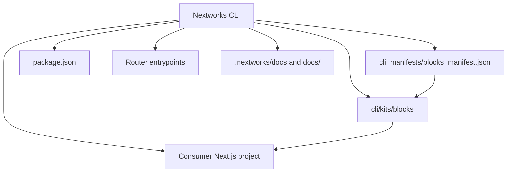

# nextworks-cli Project Overview

🚀 **Next.js CLI for installing the Nextworks Blocks kit** — core UI primitives, reusable landing page sections, and page templates into existing Next.js projects.

---

## Summary

`nextworks` is a TypeScript monorepo centered on a CLI package (`nextworks`) that installs a copy-in Blocks kit into Next.js apps.

The repo contains:

- the published CLI in `cli/`
- the installable kit source in `cli/kits/blocks/`
- parallel source packages in `packages/blocks-core`, `packages/blocks-sections`, and `packages/blocks-templates`
- manifests and docs that describe what gets copied and how installs are patched

The current product surface is intentionally narrow: one supported kit, `blocks`, focused on marketing/landing-page UI.

---

## 📌 Problem (Core Idea)

Next.js teams often want to add polished, production-ready marketing UI without building every foundational piece from scratch.

This includes:

- Core UI primitives scattered across projects or copied from different sources
- Reusable marketing sections built ad hoc in each app
- Full page templates that need to be installed manually
- Fonts, theme providers, and app-level wiring that can be easy to forget
- Router-specific setup differences between App Router and Pages Router

This creates **fragmentation, repeated setup work, and inconsistent project structure**.

➡️ **nextworks provides a shadcn-style CLI that installs a cohesive Blocks kit into a Next.js project.**

---

## 🧑‍💻 Users

| Persona           | Needs                                                         |
| ----------------- | ------------------------------------------------------------- |
| Next.js Developer | Quickly install UI primitives, sections, and templates        |
| Product Builder   | Add polished landing pages without hand-assembling everything |
| Indie Hacker      | Bootstrap SaaS/product launch pages fast                      |
| Agency / Studio   | Reuse consistent marketing layouts across client projects     |

---

## ✨ Core Features

### A) Kits and Installation Modes

The CLI centers on a single currently supported kit:

- `blocks`

Install scopes include:

- **UI only**: core primitives, providers, theme utilities, global CSS, and baseline config
- **Sections**: standalone marketing sections like Hero, Navbar, Features, Pricing, FAQ, Testimonials, etc.
- **Templates**: full page compositions built from the shared sections
- **Gallery**: a showcase page plus placeholder assets

Important behavior detail from the current CLI implementation:

- `--ui-only` installs only the `core` manifest group.
- `--sections` installs `core + sections`.
- `--templates` installs `core + sections + templates`.
- `--gallery` installs `core + sections + gallery`.
- With **no flags**, the current implementation installs **core + sections** by default.

This means the docs/readme messaging often emphasizes `--templates` as the recommended command because templates are **not** included by default in the current code path.

### B) Core UI Primitives

The Blocks kit includes reusable UI building blocks such as:

- Button
- Input
- Card
- Checkbox
- Select
- Switch
- Textarea
- Table
- Alert dialog
- Dropdown menu
- Skeleton
- Theme selector / theme toggle
- Toaster
- CTA button
- Feature card
- Pricing card
- Testimonial card
- Brand node

These are designed to be copied directly into a consuming Next.js app and are built around a small set of shared design tokens and CSS-variable hooks.

### Core UI implementation notes

The core package is not just a collection of generic primitives; it is the styling and provider foundation that makes the template system work:

- `BlocksAppProviders` is the client-safe provider composition layer and currently wraps `EnhancedThemeProvider`.
- `EnhancedThemeProvider` wraps `next-themes`, tracks a `ThemeVariant`, supports custom token overrides, persists custom colors in `localStorage`, and mirrors theme state into cookies.
- Theme variants are applied by mutating CSS custom properties on `document.documentElement`.
- `ThemeSelector` exposes the theme-variant system in the gallery/demo experience, including a lightweight custom-color modal.
- There is both a **client-safe** provider surface and a **server-only** provider surface:
  - `AppProviders.client.tsx` for client-safe usage
  - `AppProviders.server.tsx` + `server/theme-vars.tsx` for App Router server-side cookie-based initial theme variable injection
- Shared components such as `Button`, `Card`, `FeatureCard`, `PricingCard`, `TestimonialCard`, and `ThemeToggle` all expose className and slot-based override surfaces.
- Several components intentionally read preset CSS variables like `--btn-*`, `--card-*`, `--navbar-*`, `--input-*`, `--badge-*`, `--footer-*`, and `--table-*` so templates can restyle them without rewriting component structure.
- `Button` also includes an `unstyled` escape hatch and opt-in CSS-variable hooks, which is central to how presets can partially or fully take over styling.
- `CTAButton` bridges `next/link` with the shared `Button` API so sections/templates can compose CTA links with consistent behavior.

This means the core package is doing two jobs at once: providing base UI primitives, and acting as the contract layer for theme/preset-driven customization.

### C) Shared Sections

Reusable section components include:

- Navbar
- Hero variants
- Features
- Pricing
- Testimonials
- FAQ
- Contact
- CTA
- Footer
- Newsletter
- Portfolio
- Services grid
- Team
- Trust badges
- Process timeline
- About

These sections are opinionated compositions over the core primitives.

#### Composition patterns observed in the shared sections

- `Navbar` composes `Button`, `ThemeToggle`, `Link`, and mobile menu state.
- `HeroSplit` composes `Button` and `next/image` and supports text/image slots, CTA variants, and fallback content.
- `Features` composes `FeatureCard` and uses `motion/react` for staggered entrance animation.
- Sections generally expose:
  - root `className` overrides
  - nested slot overrides like `section`, `container`, `heading`, `subheading`, `grid`, `card`, `image`, etc.
  - enable/disable motion flags
  - aria labels and semantic wrappers
- The shared section package exports a focused public API from `src/components/index.ts`, which is also how templates import the building blocks.

### D) Templates

The kit currently includes these prebuilt page templates/routes:

- Product Launch
- SaaS Dashboard
- Digital Agency
- Gallery

Templates are installed in a router-native structure:

- **App Router**: `app/templates/<template>/**`
- **Pages Router**:
  - route entry file: `pages/templates/<template>/index.tsx`
  - supporting files: `components/templates/<template>/**`

#### Template architecture

The templates are full-page compositions built from the shared sections rather than independent design systems.

- `Page.tsx` files assemble the actual page order.
- `PresetThemeVars.tsx` files declare template-specific CSS variables for buttons, cards, badges, footers, tables, and inputs.
- Template-specific component files mostly customize shared sections with preset branding, layout tweaks, and fallback visual content.
- Some templates also include decorative or illustrative helpers such as `NetworkPattern`, `Dashboard`, and `SmoothScroll`.

A few representative patterns:

- **ProductLaunch** uses a classic marketing funnel: Navbar → Hero → trust badges → about → features/process → testimonials → CTA → pricing → FAQ → contact → footer.
  - Notably, `ProductLaunchPage` currently imports `PresetThemeVars` but does **not** wrap the page in it in the package source, suggesting an in-progress or partially disabled preset wrapper there.
- **SaaSDashboard** leans into a product-demo layout with a dashboard mockup, floating cards, a `SmoothScroll` helper, and stronger blue/cyan preset styling.
- **DigitalAgency** uses a bolder visual treatment with gradient branding, a custom `NetworkPattern` hero fallback, services/portfolio/process sections, and a stronger agency-style hierarchy.
- **Gallery** acts like a showcase/reference page, exposing many shared section variants and using `ThemeSelector` plus preset CSS variables as a live demonstration surface.

### E) Search / Discovery Surfaces

The repo itself does not implement a user-facing app search experience. Instead, discoverability is handled through:

- CLI commands and flags
- generated file structure
- documentation files in the kit and `docs/`
- manifest-driven installs

### F) Router Compatibility and App Wiring

The CLI automatically handles important app-level concerns:

- wraps the app with local kit `AppProviders`
- patches App Router layouts or Pages Router `_app.tsx`
- ensures `suppressHydrationWarning` on App Router `<html>` and in Pages Router `_document.tsx`
- injects `next/font/google` imports and font instances in a Turbopack-safe way
- injects the toaster component
- keeps `app/globals.css` and `app/tw-animate.css` in sync with the kit
- supports root-dir and `src/`-dir Next.js projects
- contains special handling for **hybrid** projects that have both `/app` and `/pages`

A subtle but important architectural point: the CLI installs **local wrapper files** like `components/app-providers.tsx`, `components/app-providers.app.tsx`, and `components/app-providers.pages.tsx` rather than making the consuming app directly wire package internals. This helps keep provider/context resolution stable in copied projects.

### G) Package Manager Awareness

The CLI detects and supports:

- npm
- pnpm
- yarn

It can also be forced with `--pm`.

### H) Safety / Dry Run / Removal

Helpful workflows include:

- `--dry-run` to preview file changes
- `remove blocks` to uninstall the kit
- `list` to show installed kits
- `doctor` to check compatibility and install readiness
- install tracking in `.nextworks/config.json`

Current implementation notes:

- install/remove is tracked at the file/dependency level in `.nextworks/config.json`
- `remove blocks` prefers tracked installed files first, then falls back to the manifest if needed
- uninstall is intentionally **best effort**; the docs correctly recommend git-based revert as the safest rollback path
- `doctor` is now a substantive preflight diagnostic command rather than just a stub. It currently checks:
  - `package.json` presence and whether `next` is installed
  - project root mode detection (`root` vs `src`)
  - router detection (`app`, `pages`, or `hybrid`)
  - Node.js compatibility (currently Node 20+)
  - detected package manager and install command
  - Yarn Plug'n'Play detection with guidance to switch to `nodeLinker: node-modules`
  - Tailwind detection via dependency presence and CSS-based Tailwind v4-style imports
  - TypeScript detection via `tsconfig.json` and/or `typescript` dependency
  - project root writability
  - router patch target writability for `app/layout.tsx`, `pages/_app.tsx`, and `pages/_document.tsx`
  - whether `suppressHydrationWarning` is already present where expected
  - local `components/app-providers.tsx` shim presence and whether it points to the router-appropriate target
  - likely install collisions for common kit paths and template destinations
  - recorded installed kits from `.nextworks/config.json`
  - whether tracked Blocks-installed files are still present on disk
- the current `doctor` output is both human-readable and structured enough internally to support richer future reporting; it already goes beyond the older overview text that described it as only partially implemented

### I) GitHub / Environment Compatibility

The repository explicitly supports:

- App Router and Pages Router
- Windows, macOS, Linux
- npm, pnpm, yarn
- Node.js 20+ for CLI usage
- Next.js 16.x sandboxed installs in CI
- Tailwind CSS based consuming apps

There is also explicit Yarn Plug'n'Play detection and a guided fallback to `nodeLinker: node-modules`, because Yarn PnP is treated as a frequent source of Next.js/Turbopack issues.

The root and CLI READMEs now also frame the most reliable alpha path very explicitly:

- create a fresh Next.js app
- run `npx nextworks@latest add blocks --templates`
- prefer TypeScript + Tailwind CSS projects
- use `--yes` for non-interactive/CI installs
- treat `--templates` as the recommended install path, while `--sections --templates` remains accepted mainly for backward compatibility in older docs/demo material

---

## 🗄️ Data Model (Project Structure Draft)

> This is not an application database schema. It is a structural view of the repository’s main moving parts.

```text
nextworks-cli
├─ cli/                      # CLI package users run via npx nextworks
│  ├─ src/                   # command entrypoints and install logic
│  ├─ kits/blocks/           # files copied into user projects
│  └─ README.md              # canonical CLI usage and safety docs
├─ packages/
│  ├─ blocks-core/           # shared UI primitives and providers
│  ├─ blocks-sections/       # reusable marketing sections
│  └─ blocks-templates/      # preassembled landing page templates
├─ cli_manifests/            # manifest describing what the CLI copies
├─ docs/                     # quickstarts and file-change guides
└─ .continue/context/        # project overview and AI context files
```

### Notable internal concepts

- **Manifest-driven file copying**: `cli_manifests/blocks_manifest.json` determines which files belong to `core`, `sections`, `templates`, and `gallery`.
- **Router-aware mapping**: `mapKitPathToProject()` rewrites paths differently for App Router vs Pages Router and for root-dir vs `src/` projects.
- **Template path rewriting for Pages Router**: only the route entry file is placed in `pages/templates/<slug>/index.tsx`; helper files are relocated to `components/templates/<slug>/**`, and imports are rewritten accordingly.
- **Provider shims**: app/provider entrypoints are generated or patched to match router mode.
- **Theme vars and fonts**: central to how the kit is styled after installation.
- **Installation tracking**: `.nextworks/config.json` records installed kits, dependencies, files, and timestamps.

---

## 🧱 Tech Stack

| Category                  | Choice                                                             |
| ------------------------- | ------------------------------------------------------------------ |
| Runtime                   | Node.js CLI                                                        |
| Language                  | TypeScript                                                         |
| Framework Target          | Next.js                                                            |
| Package Distribution      | npm packages + copy-in kit assets                                  |
| CLI Parsing               | commander                                                          |
| File Ops                  | fs-extra + path utilities                                          |
| Package Manager Detection | lockfile-based detection + user agent fallback                     |
| UI Kit                    | React components for Next.js apps                                  |
| Styling                   | Tailwind CSS v4 + vendored `tw-animate.css` + CSS-variable presets |
| Router Support            | App Router and Pages Router                                        |
| Delivery Style            | shadcn-style install/copy workflow                                 |

---

## 💰 Monetization

The repository itself does not implement billing logic in the code shown here.

However, the project positioning suggests a productized CLI with:

- an alpha distribution model
- potentially paid tiers in the future
- reusable Blocks assets that can evolve into a broader ecosystem

At present, monetization is not a primary code concern in this repository snapshot.

---

## 🎨 UI / UX

The product experience is centered around the **installed templates and sections**, not a traditional web app UI in this repo.

### Design direction

- Minimal, developer-friendly visuals
- Dark-mode-friendly styling
- Landing pages inspired by modern SaaS aesthetics
- Template-driven composition
- Reusable, consistent visual language across sections

### Template structure and visual goals

The templates aim to provide:

- polished hero sections
- clear social proof
- strong CTA placement
- pricing and feature blocks
- footer/contact patterns
- reusable marketing page skeletons

### Compatibility notes

- Tailwind-based styling is required
- fonts/providers are wired by the CLI for reliability
- placeholder assets are bundled for gallery/template previews
- templates intentionally rely on preset CSS variables so the same shared components can appear visually distinct across templates
- motion is used selectively: shared sections like `Features` animate on entry, while hero/dashboard components add more template-specific flair
- the repo currently vendors animation CSS into `app/tw-animate.css` and verifies that in CI

---

## 🔌 API Architecture



The CLI works primarily by:

1. reading the Blocks manifest
2. selecting file groups based on flags
3. copying files into the consuming app
4. patching router entrypoints
5. merging dependencies into `package.json`

Additional implementation details worth noting:

- `copyFiles()` maps `app/templates/*` differently depending on router mode.
- Pages Router installs rewrite template-local imports so helpers live outside `pages/`.
- The CLI adjusts provider entrypoints differently for App Router vs Pages Router, including special handling for hybrid repos.
- `updatePackageJson()` merges dependencies and writes override fields differently for npm (`overrides`), pnpm (`pnpm.overrides`), and yarn (`resolutions`).
- `--dry-run` mirrors the install plan without writing files, which is useful for understanding the generated structure before committing.
- CI smoke tests build fresh sandbox apps after installation, including a larger matrix over OS / Node / router / package manager / Next.js versions.

There is no public API server in this repository snapshot.

---

## 🔐 Auth Flow

There is no app authentication flow implemented in the codebase snapshot.

The repository is a CLI and component kit installer, so authentication would belong to consuming applications rather than the CLI itself.

---

## 🧠 AI Feature Flow

There are no implemented AI flows in the current code shown.

The repository does not yet include OpenAI integration or prompt/summary generation logic. Any future AI capability would likely live in the installed product, not in the installer itself.

---

## 🗂️ Development Workflow

The repo is set up as a monorepo with a clear split between:

- CLI orchestration (`cli/src/**`)
- copy-in kit assets (`cli/kits/blocks/**`)
- reusable package source (`packages/blocks-*/**`)
- docs/manifests/CI verification

Typical development loop:

1. update package/component/CLI source
2. keep `cli/kits/blocks/**` and `cli_manifests/blocks_manifest.json` aligned
3. build workspaces
4. run install smoke tests against fresh Next.js sandbox apps
5. update docs if install behavior or generated file structure changed

Repository workflow characteristics observed:

- smoke tests verify kit installs across routing modes
- a full matrix workflow verifies OS / Node / Next.js / router / package-manager combinations
- docs explain install, safety, troubleshooting, and alpha expectations
- root and `cli/` READMEs are closely aligned around the recommended `add blocks --templates` workflow
- file manifests make the install behavior inspectable

Recommended authoring patterns:

- change source in `cli/src/`, `packages/blocks-*`, or `cli/kits/blocks/`
- keep manifests aligned with copied kit files
- keep the installed-app docs under `cli/kits/blocks/.nextworks/docs/` in sync with CLI behavior
- use git-first safety guidance consistently in docs because installs are overwrite-capable

---

## 🧭 Roadmap

### **MVP / Current alpha baseline**

- CLI install of the Blocks kit
- Core UI primitives
- Shared marketing sections
- Full page templates
- App Router and Pages Router support
- root-dir and `src/`-dir support
- dependency merging
- provider, font, and CSS wiring
- dry-run, list, doctor, remove commands
- install tracking via `.nextworks/config.json`

### **Pro Phase**

Potential future improvements may include:

- more templates and sections
- additional kits beyond `blocks`
- richer interactive installation flow
- deeper customization options
- improved compatibility checks
- versioned kit management

### **Future Enhancements**

- broader kit ecosystem
- more template categories
- stronger verification and linting of copied files
- enhanced docs generation
- smoother hybrid router support
- better patching for heavily customized entrypoints

---

## 📌 Status

- Early-access alpha
- the CLI, copied kit, and package source are all present and functional
- the main focus is Blocks installation, router patching reliability, and documentation clarity
- CI coverage is stronger than a typical prototype, especially around fresh-install verification
- some surfaces are still in progress or unevenly polished (for example some docs phrasing and a few source/package inconsistencies like ProductLaunch preset wrapping)
- compared with earlier overview notes, `doctor` has progressed into a meaningful diagnostics surface for compatibility, patchability, collisions, and tracked-install integrity
- best suited for experimentation and iterative improvement

---

🏗️ **nextworks — Install smarter. Ship faster.**
